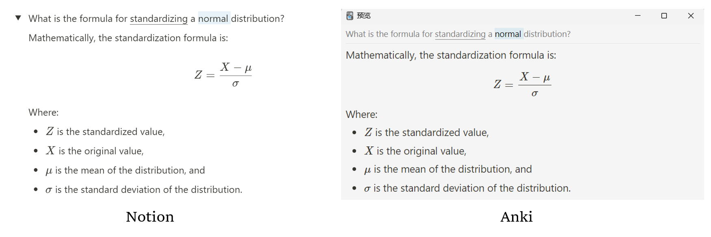
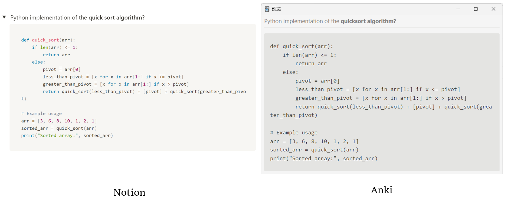

# Notion2Anki addon
[](https://github.com/BaiRuic/Notion2Anki)
[](https://www.gnu.org/licenses/gpl-3.0)
[](https://github.com/psf/black)

An [Anki](https://apps.ankiweb.net/) addon that loads toggle lists from [Notion](https://notion.so) as notes to different deck.

This project is forked from [notion-anki-sync](https://github.com/9dogs/notion-anki-sync). I've made enhancements to the original project and added the following features:
+ Adding Notes from Different Pages to **Different Anki Decks**

Here are two screenshots demonstrating the rendering of code blocks and formula blocks from Notion, as well as the rendering of bold text style and background color.



## How it works
The general process involves initially exporting the page content as HTML, followed by converting the HTML into Flask cards for importing into their respective decks. Specifically:

>1. You provide a set of Notion page IDs to export.
>2. Each "toggle list" block from Notion will be transformed into an Anki note.
>3. The title of the toggle block becomes the front side, and its content becomes the back side.
>4. Lines starting with #tags are parsed as tags.
>5. Toggles can be ignored by prefixing the toggle title with the ❕ symbol (type ":!" in Notion and select the white one).
>6. Clozes can be added using code blocks within toggle titles. The backside will be ignored (except for tags).

>Synchronization can work in the background or can be triggered manually from the `NotionSync` submenu in the `Tools`
section. Note that background sync **does not remove** any notes; if you want to remove the obsolete notes, then
trigger `Load and remove obsolete` from the submenu.

## Requirements

### Notion API token

To get **Notion API token** log in to Notion via a browser (assuming Chrome here),
then press `Ctrl+Shift+I` to open Developer Tools, go to the "Application" tab
and find `token_v2` under Cookie on the left.

### Notion page ids

To get **Notion page id** open up the page in a browser and look at the
address bar. 32 chars of gibberish after a page title is the page id:
`https://www.notion.so/notion_user/My-Learning-Book-8a775ee482ab43732abc9319add819c5`
➡ `8a775ee482ab43732abc9319add819c5`

Edit plugin config file from Anki: `Tools ➡ Add-ons ➡ Notion Toggles Loader ➡ Config`
```json
{
  "debug": false,
  "sync_every_minutes": 30,
  "notion_token": "<your_notion_token_here>",
  "notion_namespace": "<your_notion_username_here",
  "notion_pages": [
    {
      "page_id": "<page_id1>",
      "recursive": false,
      "target_deck": "<deck_1>"
    },
    {
      "page_id": "<page_id2>",
      "recursive": true,
      "target_deck": "<deck_2>"
    }
  ]
}
```

## Configuration parameters

- `debug`: `bool [default: false]` — enable debug logging to file.
- `sync_every_minutes`: `int [default: 30]` — auto sync interval in minutes. Set to 0 to disable auto sync.
- `notion_token`: `str [default: None]` — Notion APIv2 token.
- `notion_namespace`: `str [default: None]` — Notion namespace (your username) to form source URLs.
- `notion_pages`: `array [default: [] ]` — List of Notion pages to export notes from.
  - `page_id`: 32 chars of Notion page id.,
  - `recursive`: If true, Page should be exported with all its subpages.,
  - `target_deck`: The target deck is a string attribute that specifies the name of the deck where loaded notes will be added. If multiple page_ids refer to the same target_deck, their corresponding notes will be combined and added to the same target_deck.

## Known issues & limitations

Behind the scenes, the addon initiates Notion pages export to HTML, then parses the HTML into notes. Since non-public
Notion API is used, the addon may break without a warning.

- As for now, LaTeX and plain text cannot be used in the same cloze: Notion puts them in separate `code` tags which
  leads to the creation of two cloze blocks.

- Some toggle blocks are empty on export which leads to empty Anki notes. The issue is on the Notion side (and they're
  aware of it).

- The color of the code block cannot be rendered.